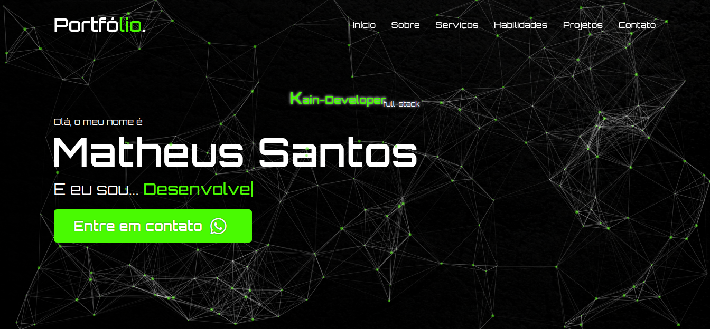
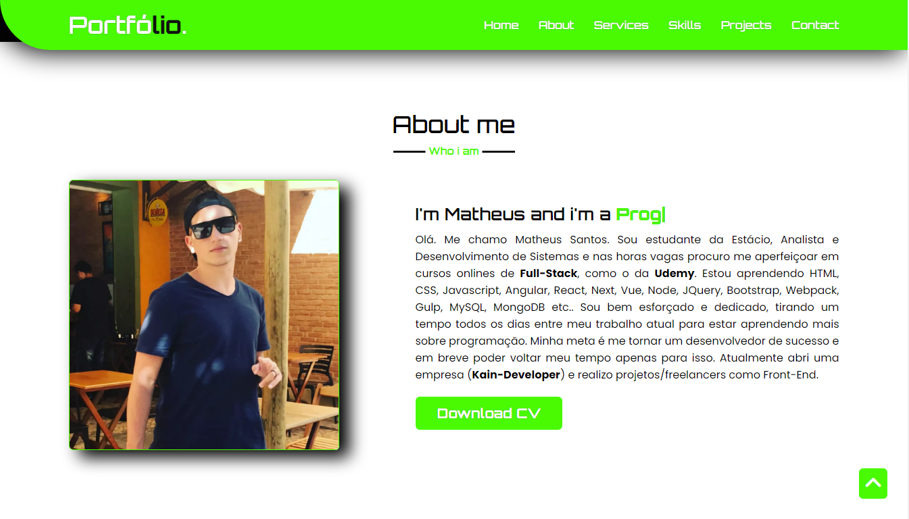
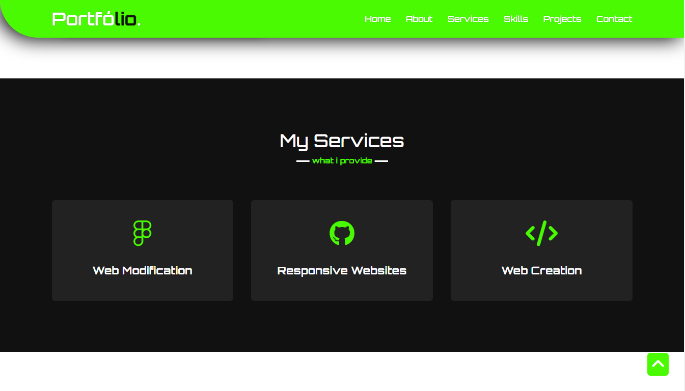
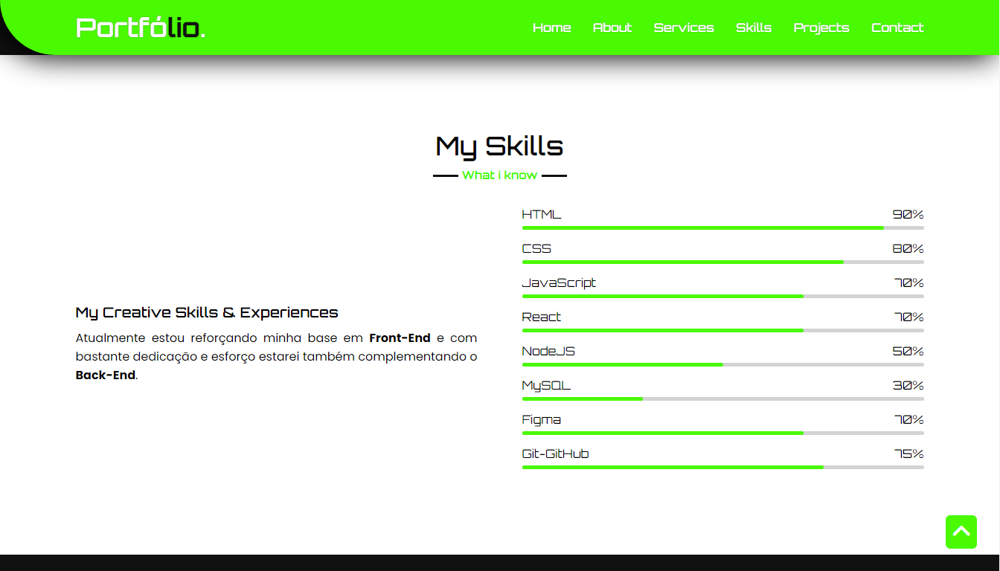
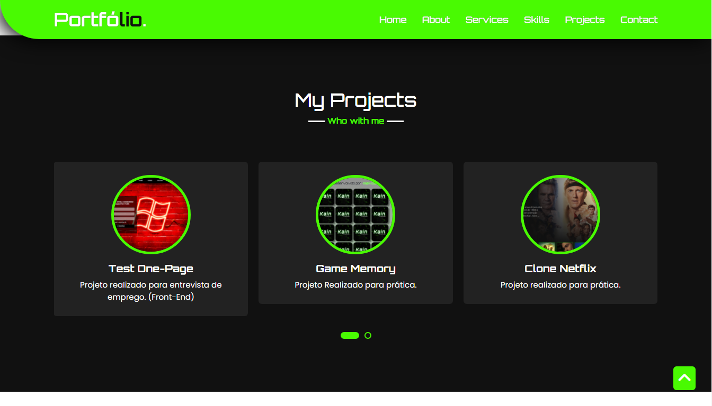
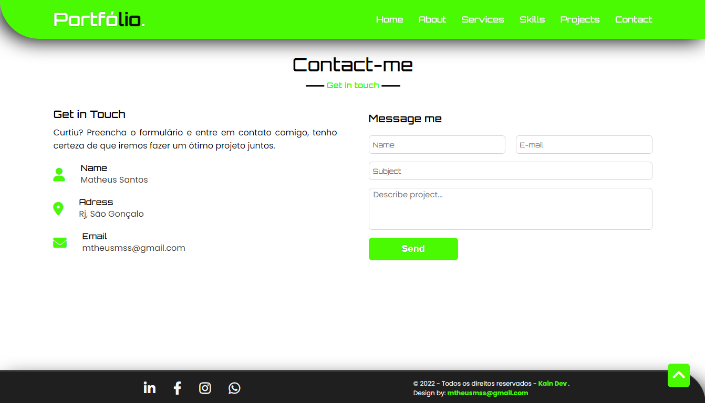

### My Portfólio ↓
> Link on air: <a href="https://kain-portfolio.onrender.com/">https://kain-portfolio.onrender.com/ </a>

 
 
 

> Resultado do Portifólio finalizado.

## O projeto consiste em:

> Uma pequena apresentação trazendo as seguintes seções:
- Sobre mim;
- Meus serviços;
- Minhas habilidades;
- Meus projetos;
- Contato;

**OBS** - Na seção de contato se encontra um formulário ativo, onde foi feito tratativas de erros mostrando no proprio formulário o resultado e caso o preenchimento seja válido, os dados serão enviados para um banco de dados onde consigo ler em outro projeto.

### Tecnologias Usadas:

- <strong>NodeJS</strong>;
- <strong>Express</strong>;
- <strong>EJS</strong>;
- <strong>MongoDB (ATLAS)</strong>;

Resultado: <a href="https://kain-portfolio.herokuapp.com">https://kain-portfolio.herokuapp.com</a>

## 🤝 Colaboradores

Pessoa que contribuiu para este projeto:

<table>
  <tr>
    <td align="center">
      <a>
         
        
          <b>Matheus Santos</b>
        
      </a>
    </td>
   </tr>
</table>
